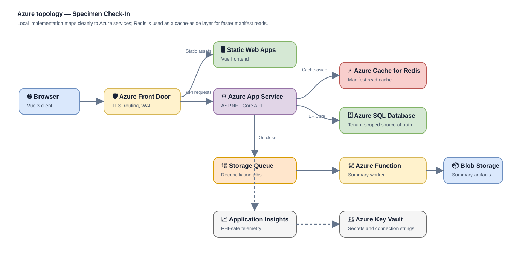

# 🧪 Specimen Check-In Vertical Slice

A focused full-stack implementation for checking pathology specimen bottles against shipment manifests.  
The solution supports received, missing, and off-manifest specimen flows while enforcing tenant isolation on the server.

---

## ✨ Features

- 📋 Manifest worklist and specimen detail view
- ✅ Receive expected specimens safely
- ⚠️ Flag missing specimens and create discrepancies
- ➕ Add off-manifest specimens
- 🔒 Server-side tenant isolation with `X-Lab-Id`
- 🧪 NUnit service tests with EF Core InMemory
- 🚀 GitHub Actions build and test workflow

---

## 🧰 Stack

| Layer | Technology | Purpose |
|---|---|---|
| ⚙️ API | ASP.NET Core Web API | REST endpoints and business logic |
| 🗄️ Data | EF Core + SQL Server | Code-first relational persistence |
| 🖥️ UI | Vue 3 + TypeScript + Vite | Lightweight frontend for the Check-In screen |
| 🔌 HTTP | Axios | Frontend-to-API calls |
| 🧪 Tests | NUnit + EF Core InMemory | Fast service-level validation |
| ☁️ CI | GitHub Actions | Backend tests and frontend production build |

---

## 🗂️ Project Structure

```text
specimen-checkin/
├── .github/
│   └── workflows/
│       └── build-and-test.yml
├── docs/
│   ├── azure-topology.drawio
│   └── azure-topology.svg
├── SpecimenCheckIn.Api/
│   ├── Controllers/
│   ├── Data/
│   ├── DTOs/
│   ├── Enums/
│   ├── Infrastructure/
│   ├── Models/
│   ├── Services/
│   └── Migrations/
├── SpecimenCheckIn.Tests/
│   ├── Infrastructure/
│   └── Services/
├── specimen-checkin-ui/
│   └── src/
└── SpecimenCheckIn.sln
```

---

## ▶️ Run Locally

### 1. Configure SQL Server

Update the connection string in:

```text
SpecimenCheckIn.Api/appsettings.Development.json
```

Example:

```json
{
  "ConnectionStrings": {
    "DefaultConnection": "Server=(localdb)\\MSSQLLocalDB;Database=SpecimenCheckInDb;Trusted_Connection=True;TrustServerCertificate=True;"
  }
}
```

### 2. Apply EF Core Migrations

```bash
dotnet ef database update --project SpecimenCheckIn.Api --startup-project SpecimenCheckIn.Api
```

### 3. Run the API

```bash
dotnet run --project SpecimenCheckIn.Api
```

Swagger should open at a URL similar to:

```text
https://localhost:7198/swagger
```

### 4. Configure the Frontend

Update:

```text
specimen-checkin-ui/src/api/api.ts
```

Example:

```ts
import axios from 'axios'

const api = axios.create({
  baseURL: 'https://localhost:7198/api',
  headers: {
    'X-Lab-Id': '11111111-1111-1111-1111-111111111111'
  }
})

export default api
```

### 5. Run the Frontend

```bash
cd specimen-checkin-ui
npm install
npm run dev
```

Open the Vite URL, usually:

```text
http://localhost:5173
```

### 6. Run Tests

From the repository root:

```bash
dotnet test
```

---

## 🔐 Tenant Context

Every API request includes:

```http
X-Lab-Id: <tenant-guid>
```

Example seed values:

```text
Lab A: 11111111-1111-1111-1111-111111111111
Lab B: 22222222-2222-2222-2222-222222222222
```

The middleware stores the tenant in a scoped context. The service layer includes the tenant key in every read and write query, so route IDs alone cannot be used to access another lab's data.

---

## ☁️ Azure Topology



Editable Draw.io source: [`docs/azure-topology.drawio`](docs/azure-topology.drawio)

### Redis Strategy

Azure Cache for Redis is used as a **cache-aside** layer for frequently accessed manifest worklists and detail reads.

- Read: check Redis first, then fall back to Azure SQL.
- Write: persist to Azure SQL first, then invalidate the affected cache key.
- Keys must include `LabId` to preserve tenant boundaries.

Azure SQL remains the system of record.

---

## 🚧 Way Forward

1. Add optimistic concurrency handling for simultaneous technician updates.
2. Replace the seeded tenant header with authenticated user and tenant claims.
